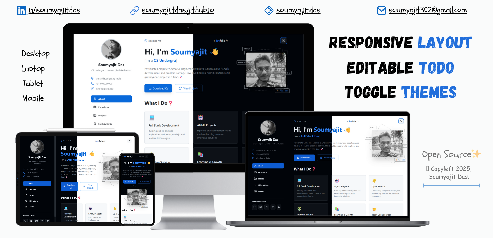

# Hey there! 👋 This is my portfolio.

<a href="#"></a>
<a href="#"></a>
<a href="#"></a>
<a href="#"></a>
<a href="https://soumyajiitdas.github.io/"></a>
<a href="#"></a>



This is my personal corner of the internet! I built this portfolio to showcase my journey as a developer, the projects I've worked on, and the skills I've picked up along the way. It's built with technologies like React, Vite, and Tailwind CSS.

## 🚀 Live Demo

🌐 Check it out live: [https://soumyajiitdas.github.io/](https://soumyajiitdas.github.io/)

## ✨ Features

-   📱 **Fully Responsive:** Looks great on any device, from your phone to your desktop.
-   🌙 **Dark Mode:** Easy on the eyes, especially during those late-night coding sessions.
-   📝 **Dynamic Content:** All the portfolio data lives in a single file, so it's a breeze to update.
-   🤩 **Interactive UI:** I've added some fun touches like a typewriter effect to keep things interesting.
-   🔎 **Project Filtering:** Easily filter through my projects to see what I've been up to.
-   📬 **Contact Form:** Want to say hi? You can send me a message directly from the site.
-   ✍️ **Editable Current Focus:** Easily update your current focus or status. and It uses browsers local storage to store data, meaning your edited data remain unchanged.

## 🛠️ What I Used

-   **React:** For building the user interface.
-   **Vite:** For a super-fast development experience.
-   **Tailwind CSS:** To make it look pretty without writing a ton of CSS.
-   **React Router:** To handle navigation between pages.
-   **Radix UI:** For accessible and unstyled UI components.
-   **Lucide React:** For the beautiful and consistent icons.

## 💻 Getting Started

Want to run this project locally? Here's how:

1.  **Clone the repo:**
    ```sh
    git clone https://github.com/soumyajiitdas/soumyajiitdas.github.io.git
    ```
2.  **Install the dependencies:**
    ```sh
    npm install
    ```
3.  **Start the development server:**
    ```sh
    npm run dev
    ```
    Now you can open your browser and visit `http://localhost:3000` to see it in action!

## 🚀 Deployment

I've set this up to deploy to GitHub Pages. The `deploy` script in the `package.json` file takes care of everything.

```sh
npm run deploy
```

## 📃 License

This project is licensed under the MIT License. See the `LICENSE` file for more details.

## 🤝 Let's Connect!

I'm always open to connecting with other developers, so feel free to reach out!

-   🐙 **GitHub:** [@soumyajiitdas](https://github.com/soumyajiitdas)
-   💼 **LinkedIn:** [Soumyajit Das](https://linkedin.com/in/soumyajiitdas)
-   📧 **Email:** `soumyajit302@gmail.com`

<p align="center"><strong>Thanks for stopping by! 😊</strong></p>

---